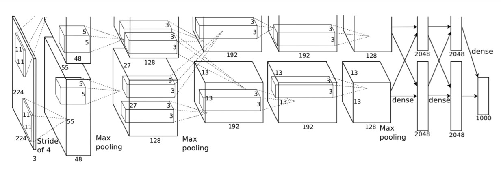

# Alexnet
> @Fire 2019.7.1

* Intro: 2012年，Alex等人提出的AlexNet网络在ImageNet大赛上以远超第二名的成绩夺冠，卷积神经网络乃至深度学习重新引起了广泛的关注。

* Year: 2012
* Paper: [ImageNet Classification with Deep Convolutional Neural Networks](http://xueshu.baidu.com/usercenter/paper/show?paperid=bfdf67dfdf8cea0c47038f63e91b9df1&site=xueshu_se)
* Code: [keras_alexnet](keras_alexnet.py)
* Info: 224 * 224 * 3的输入，6的输出，参数量为7千万。

* Note: 

	1. 数据增强：图像裁剪（crop），水平翻转；颜色、光照变换（使用PCA对每个像素点RGB分别加一个数）。
	2. Dropout：以一定概率使神经元的输出为0，减少过拟合。
	3. ReLU：方便计算，求导容易，使网络变得稀疏（类似L1正则），能够更快的学习。
	4. Local Response Normalization：局部响应归一化，利用临近的数据做归一化。贡献了1.2%的Top-5正确率。
	5. Overlapping Pooling：即Pooling的步长比Pooling Kernel小。贡献了0.3%的Top-5正确率。
	6. 多GPU学习。

