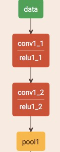
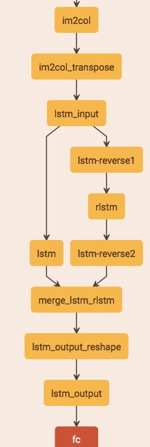
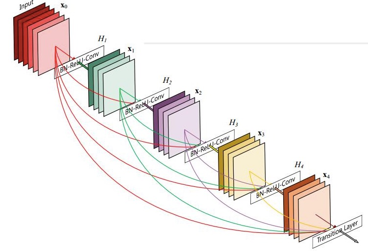
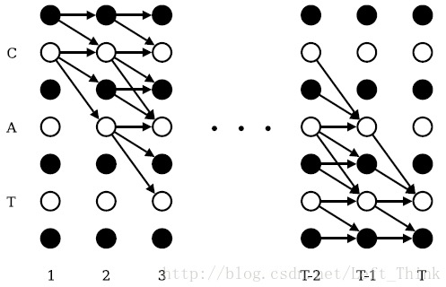

## [chinese-ocr模型说明文档](https://github.com/YCG09/chinese_ocr)
> Fire 2018.10.18

### 基本架构
* 文本检测：CTPN （输出包含文字的图片框）
* 文本识别：DenseNet + CTC (输出识别字符)

### CTPN

   

1. 输入图片 （1 * 3 * 224 * 224）
2. vgg提取空间特征，conv5输出：N * C * H * W （1 * 512 * 14 * 14）
3. rpn_conv层：每个点取周围3 * 3区域做滑窗，输出：N * 9C * H * W （1 * 4608 * 14 * 14）
4. 双向LSTM层提取序列特征（正反各128）：对3中的每一行当作一个数据输入，然后reshape成 N * 256 * H * W（1 * 256 * 14 * 14）
5. FC层：N * 512 * H * W（1 * 512 * 14 * 14）
6. RPN网络：
	* 回归：1 * 20 * 14 * 14  （36 = 2 * 10；x,y偏移）
	* 分类：1 * 20 * 14 * 14  （18 = 2 * 10；前景或者背景）
7. NMS非极大值抑制

	

### DenseNet+CTC

1. densenet: 
	
	
	
	* 每个denseblock中都连接每层的残差
	* block基本结构: BN+Relu+Conv+dropout
	* flatten成一维
	* 输出层 dense(5000)

	
	
2. CTC-loss：损失函数可以解释为：给定样本后输出正确label的概率的乘积，最优化负对数。

	
	
	e.g. [1 * 8] -> -AA--B-C -> ABC